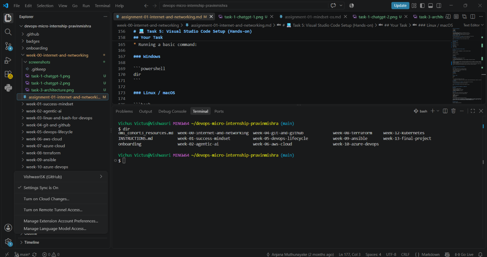

# Week 00 - Internet and Networking

Part of the DevOps Micro Internship (DMI) Cohort 3 with Agentic AI

---

# 🧑‍💻 Task 1: Using ChatGPT as Your Learning Assistant

## Scenario

You're new to DevOps and will frequently encounter technical questions. ChatGPT can be your learning companion.

## Your Task

Write a clear ChatGPT prompt to help you understand:

> "What is a protocol in networking? Explain with a simple real-life example."

Take a screenshot of your interaction showing:

* Your detailed prompt (with clear expectations)
* ChatGPT's simplified response with an example

## Screenshot

Save your screenshot in the `screenshots` folder and update the file name below.


Replace `task-1-chatgpt.png` with your actual screenshot file name.

---

## What I Learned (2–3 lines)

I learned that a protocol is a set of rules that allows devices to communicate and understand each other over a network. Different protocols like HTTP, TCP, IP, and SSH are used for different types of communication in Cloud and DevOps.

---

# 🌐 Task 2: Internet and Networking

## Scenario

Your friend is launching an online bookstore named **EpicReads**.

He asked you to explain how users globally can access his website hosted in Finland.

## Your Task

Write a short explanation (**100–150 words**) that includes:

* Packet Switching
* IP Address
* TCP/IP
* HTTP/HTTPS

💡 **Tip:** You may use ChatGPT (as demonstrated in Task 1) to refine your explanation.

## Answer

When a user anywhere in the world opens the EpicReads website, the request is sent through the Internet using **packet switching**. The data is broken into small packets, which can travel through different networks and routes before reaching the server in Finland.

Every device connected to the Internet has an **IP address**, which works like a unique address that helps identify where the request should go. **TCP/IP** is the set of protocols responsible for delivering these packets reliably and ensuring they reach the correct destination.

Once the request reaches the EpicReads server, **HTTP/HTTPS** is used to communicate between the user's browser and the website. HTTPS is preferred because it encrypts the communication, helping protect sensitive information such as login details and payment data.

This process allows users globally to access EpicReads smoothly and securely.


---

# 🏗️ Task 3: Application Architecture & Stack

## Scenario

EpicReads bookstore has two application versions:

### Two-Tier Application

* Frontend
* Database

### Three-Tier Application

* Frontend
* Backend
* Database

## Your Task

* Draw simple diagrams (hand-drawn or tool-based such as draw.io)
* Label each layer clearly
* List at least two common technologies or tools used for each layer
* Submit a screenshot or photo clearly showing your own drawing

## Diagram Screenshot / Photo

Save your diagram image in the `screenshots` folder and update the file name below.


Replace `task-3-diagram.png` with your actual diagram file name.

---

## Technologies Used

### Frontend

HTML, CSS, JavaScript

### Backend

Java/Spring Boot, Node  

### Database

 MySQL, MongoDB

---

# 🌍 Task 4: Domain Name & DNS (Basic Concepts)

## Scenario

Your friend's bookstore **EpicReads** is currently accessible through:

```text
52.172.142.222:3000
```

He purchased the domain:

```text
epicreads.com
```

## Your Task

In **50–100 words**, explain in your own words:

1. What is DNS (Domain Name System)?
2. Which DNS record type should be used to connect the domain to the given IP, and why?

## Answer

DNS stands for Domain Name System. It helps convert a website name into its IP address. For example, instead of remembering the IP address 52.172.142.222, users can simply type epicreads.com in their browser. DNS finds the correct IP address and connects the user to the website.

To connect epicreads.com with 52.172.142.222, we use an A record. An A record is used to connect a domain name with an IPv4 address. So, when someone enters epicreads.com, DNS will point them to the given IP address.


---

# 💻 Task 5: Visual Studio Code Setup (Hands-on)

## Your Task

Install Visual Studio Code (if not already installed).

Take a screenshot of your VS Code environment showing:

* Terminal open inside VS Code
* Running a basic command:

### Windows

```powershell
dir
```

### Linux / macOS

```bash
pwd
ls
```

* Your selected VS Code theme clearly visible

⚠️ **Important:** The screenshot must show your username or another identifiable detail to confirm it is your environment.

## Screenshot

Save your screenshot in the `screenshots` folder and update the file name below.




Replace `task-5-vscode.png` with your actual screenshot file name.

---

# 🔗 Task 6: Publish Your Assignment as a LinkedIn Post

## Objective

Publishing on LinkedIn helps you:

* Build your professional online presence
* Reinforce your learning
* Document your DevOps journey publicly

## Your Task

Summarize your answers from Tasks 1–5 into a LinkedIn post.

Clearly structure your post into the following sections:

* ChatGPT
* Internet & Networking
* App Architecture
* DNS
* VS Code Setup

Add the following credit note at the end of your post:

> **P.S. This post is part of the DevOps Micro Internship (DMI) with Agentic AI — Cohort 3 — by Pravin Mishra. My graded progress is public: https://dmi.pravinmishra.com/s/YOUR-GITHUB-USERNAME.html · Start your DevOps journey: https://dmi.pravinmishra.com/?utm_source=student&utm_medium=ps-linkedin&utm_campaign=cohort3**

---

## LinkedIn Post URL

Paste your LinkedIn post URL here:

```text
https://lnkd.in/p/g_bD76f4
```

---

## LinkedIn Post Backup Copy

Paste the full text of your LinkedIn post here:

Week 0 of my DevOps Micro Internship (DMI) Cohort 3 with Agentic AI is officially completed! 🚀

This week was all about understanding the basics that form the foundation of DevOps — from networking and application architecture to DNS and development tools.

ChatGPT
I explored how ChatGPT can be used as a learning assistant and understood the concept of networking protocols through simple explanations and real-world examples.

Internet & Networking
I learned how information travels across the Internet using packet switching, IP addresses and TCP/IP. I also understood the role of HTTP and HTTPS when accessing websites.

Application Architecture
I explored two-tier and three-tier architectures and understood how frontend, backend and database layers work together to build an application.

DNS
I learned how DNS helps users access websites using domain names instead of remembering IP addresses. I also understood the purpose of an A record.

VS Code
I set up my VS Code environment, worked with the integrated terminal, and practiced basic commands.

This week gave me a better understanding of how different parts of the Internet and applications connect together, which is an important starting point for my DevOps journey.
Excited to continue learning, experimenting, and building in the upcoming weeks! 

P.S. This post is part of the DevOps Micro Internship (DMI) with Agentic AI — Cohort 3 — by Pravin Mishra. My graded progress is public: https://lnkd.in/g8fh7Ukt · Start your DevOps journey: https://lnkd.in/gAucHy7M

---

# Reflection – Week 0

### What did you find easy?

Understanding basic networking concepts and working with VS Code was easy for me.

---

### What was difficult?

Understanding how networking concepts like TCP/IP, DNS and application architecture work together was a little difficult at first.

---

### What will you improve next week?

I want to improve my understanding of DevOps concepts and get more hands-on practice with the tools.

---

## 📌 About DMI & CloudAdvisory

DevOps Micro Internship (DMI) is a project-based DevOps program run by Pravin Mishra (The CloudAdvisory) focused on real-world execution, systems thinking, and career readiness.

It helps learners build strong DevOps foundations with hands-on experience.


## 📌 Resources

- 🌐 **DMI Official Website:** https://dmi.pravinmishra.com?utm_source=github&utm_medium=readme  
- 🎓 **University:** https://university.pravinmishra.com?utm_source=github&utm_medium=readme  
- 💬 **Discord Community:** https://discord.pravinmishra.com?utm_source=github&utm_medium=readme  
- 📝 **Blog:** https://dmi.pravinmishra.com/blog?utm_source=github&utm_medium=readme  
- ▶️ **YouTube Playlist (DMI Cohort 3):** https://www.youtube.com/playlist?list=PLFeSNDtI4Cho  
- 🔗 **Pravin Mishra (LinkedIn):** https://www.linkedin.com/in/pravin-mishra-aws-trainer/  
- 🏢 **CloudAdvisory (LinkedIn):** https://www.linkedin.com/company/thecloudadvisory/

---

*This submission is part of DevOps Micro Internship (DMI) Cohort 3 — Agentic AI Track*